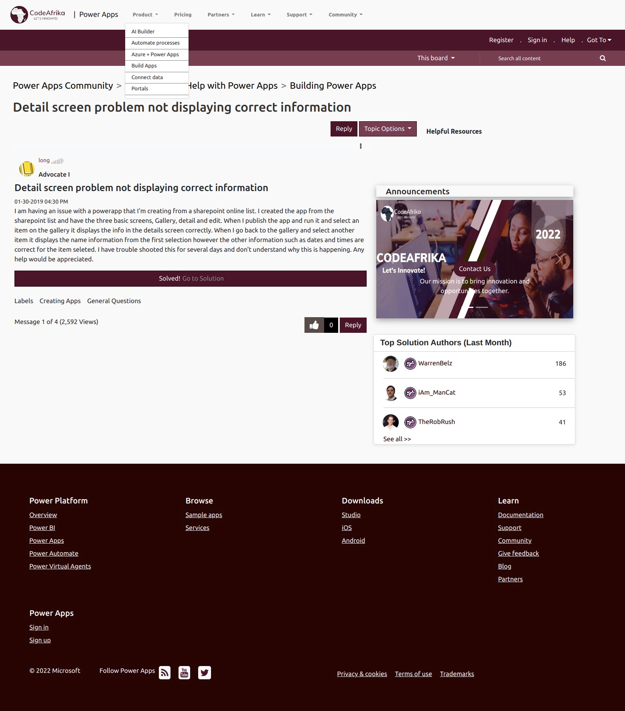
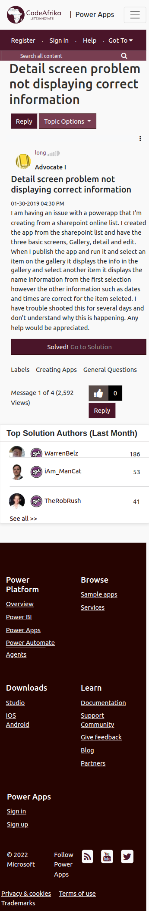

  <a href="https://www.codeafrika.co.ke/">
  
  <a>

# Challenge : Microsoft Power Users Community Clone

## Description 🚀

This is a website clone from the original Microsoft Power User Community site found [here](https://powerusers.microsoft.com/t5/Building-Power-Apps/Detail-screen-problem-not-displaying-correct-information/m-p/212434) and made layout clone (CodeAfrika) hosted it with GitHub pages [here](https://douglas254.github.io/CodeAfrika/MicrosoftClone/index.html)

## Screenshot Desktop View 📸

 

  <a href="https://douglas254.github.io/CodeAfrika/MicrosoftClone/index.html">
  
  <a>

 

## Screenshot Mobile View 📸

 

 <a href="https://douglas254.github.io/CodeAfrika/MicrosoftClone/index.html">
  
  <a>

## Setup 🛠️

- Clone the repository using git clone `https://github.com/Douglas254/CodeAfrika.git` or download and extract the CodeAfrika zip file and cd into the MicrosoftClone folder.
- Open up the cloned folder in your preferred text editor. Open up a terminal within your workspace and navigate into the `MicrosoftClone` folder
- Open the live server vs code extension and get your site up and running on `http://127.0.0.1:5500`

## Deploy ~ GitHub Pages 🌍

live link [here](https://douglas254.github.io/CodeAfrika/MicrosoftClone/index.html)

## Authors 🖊️

This project was contributed to by:

- [Douglas Obara](https://github.com/douglas254/)

## License 📄

The project is licensed under MIT
